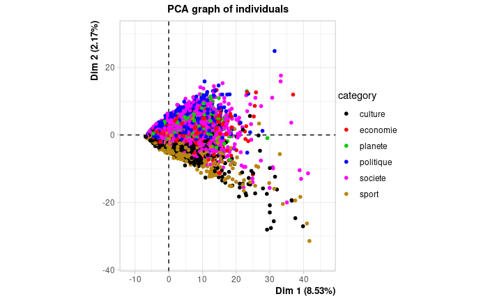
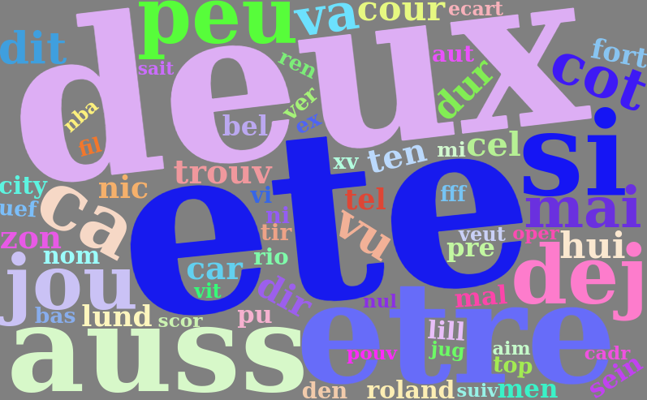
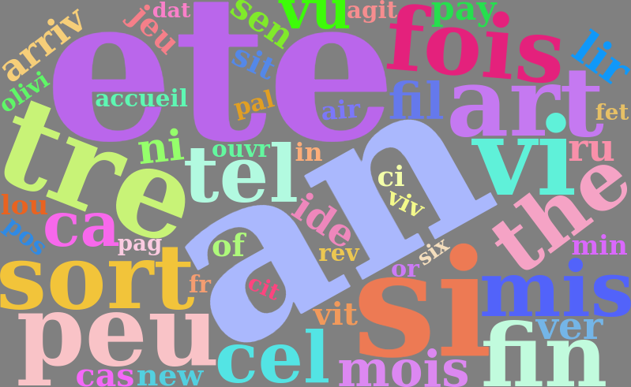
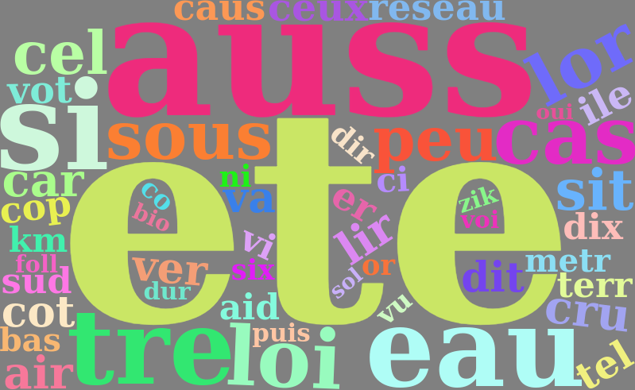
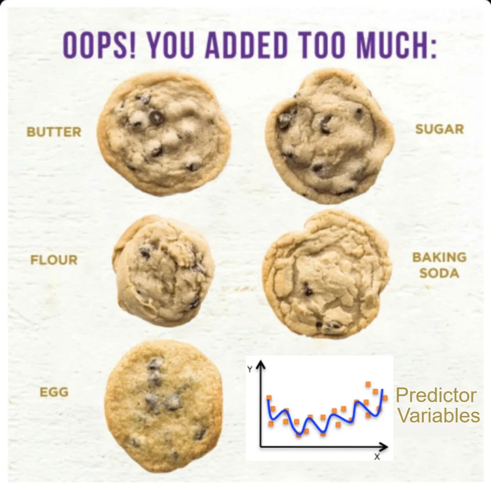
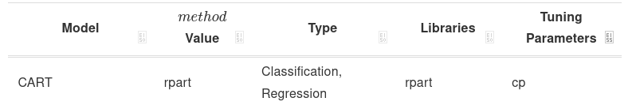
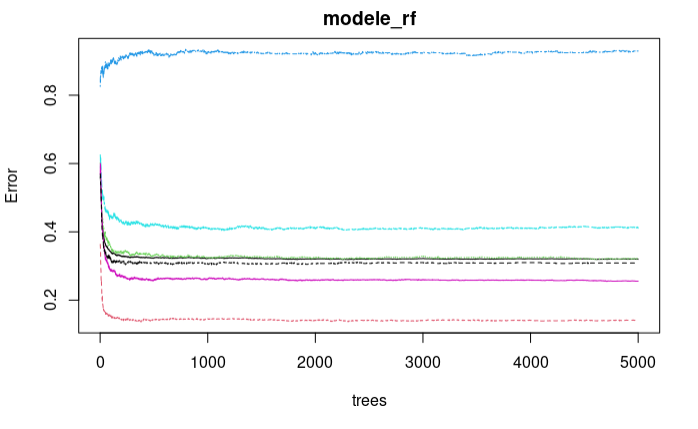
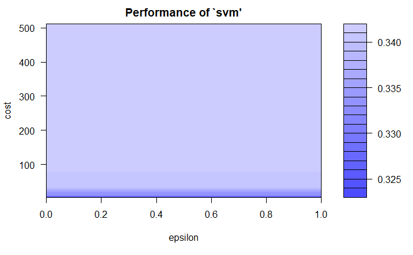
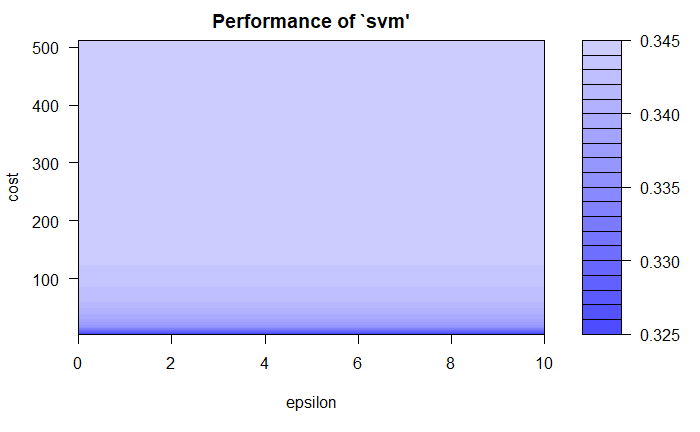

<style type="text/css">

body{ /* Normal  */
      font-size: 16px;
  }
td {  /* Table  */
  font-size: 8px;
}
h1.title {
  font-size: 55px;
  color: DarkBlue;
}
h1 { /* Header 1 */
  font-size: 38px;
  color: DarkBlue;
}
h2 { /* Header 2 */
    font-size: 38px;
  color: DarkBlue;
}
h3 { /* Header 3 */
  font-size: 35px;
  font-family: "Times New Roman", Times, serif;
  color: DarkBlue;
}
code.r{ /* Code block */
    font-size: 12px;
}
pre { /* Code block - determines code spacing between lines */
    font-size: 14px;
}
</style>

```{r setup, include=FALSE}
knitr::opts_chunk$set(echo = TRUE)
#install for export in pdf file
#tinytex::install_tinytex()
if(!require(factoextra)) install.packages("tm", repos = "http://cran.us.r-project.org")
require(factoextra)
if(!require(tm)) install.packages("tm", repos = "http://cran.us.r-project.org")
require(tm)
if(!require(wordcloud2)) install.packages("wordcloud2", repos = "http://cran.us.r-project.org")
require(wordcloud2)
if(!require(randomForest)) install.packages("randomForest", repos = "http://cran.us.r-project.org")
require(randomForest)
if(!require(SnowballC)) install.packages("SnowballC", repos = "http://cran.us.r-project.org")
require(SnowballC)
if(!require(sparkline)) install.packages("sparkline", repos = "http://cran.us.r-project.org")
require(sparkline)
# Construction de l'arbre
if(!require(rpart)) install.packages("rpart", repos = "http://cran.us.r-project.org")
require(rpart)
# Visualisation de l'arbre
if(!require(visNetwork)) install.packages("visNetwork", repos = "http://cran.us.r-project.org")
require(visNetwork)
# Test modèle KNN
if(!require(class)) install.packages("tm", repos = "http://cran.us.r-project.org")
require(class)
# Evaluation des modèles 
if(!require(caret)) install.packages("caret", repos = "http://cran.us.r-project.org")
require(caret)
 
#Import required library
library(caret)
if(!require(ROCR)) install.packages("ROCR", repos = "http://cran.us.r-project.org")
require(ROCR)
```

Nous souhaitons classifier un article du monde selon son contenu,
Nous possèdons pour cela un jeu de données avec la catégorie et le contenu de 10k articles.

Pour mener notre tâche à bien nous allons effectuer un prétraitement des données textuelles par la transformation de données (textuelles) non structurées en un format de données structuré.

Et ce dans l'objectif d'appliquer des algorithmes de classifications, cela inclut la pondération et la sélection des variables(des mots). 

Concrètement, il s'agit de la transformation d'un grand nombre de caractéristiques éparses en un nombre significativement plus petit de caractéristiques denses. 

Nous utiliserons ainsi 3 algorithmes pour la classification dont un dans une version limitée à 25 variables explicatives.

Nous finirons par l'évaluation des résultats de la prédiction des classifications sur le jeu de test.

**Résumé**
Ensemble variables explicatives Xi : nbre d'occurences des mots dans l'article.
Variable à expliquer : la catégorie de l'article.
Fonction de perte/évaluation : Matrice de confusion/AUC
Algorithmes : CART, RandomForest, SVM
Méthode pour éviter le sur-apprentissage : Validation croisée.

# Introduction
<br> </br>
## Import de la base de données & du jeu test
<br> </br>

On utilise l'encodage UTF-8 car le monde est un journal français utilisant des caractères spéciaux.
Le jeu de test est fournis, il a pour élément positif le fait d’être un article de type économie
```{r}
data <- 
   read.csv("le_monde.csv", encoding="UTF-8", sep=";", comment.char="#")
test <- 
  read.csv("lignes_jeux_tests.csv")
```

## Transformation des données
<br> </br>
Il est nécessaire de transformer ces données, nous n'avons qu'une unique variable explicative : le texte en entier de l'article.
Cette unique variable explicative est inexploitable, nous souhaitons un "bag of words".


Suppression des deux collones non utiles à la modélisation
```{r}
data$date <- NULL
data$title <- NULL
```
<br> </br>
Nous n'avons pas à réaliser la gestion des manquants, tâche qui peut s'avérer très complexe.
on supprime les lignes avec des valeurs manquantes (normalement aucune supprimmé)
```{r , echo=FALSE}
which(is.na(data))
data <- na.omit(data)
```
<br> </br>
On applique les bons types de variables
```{r}
data$category <- as.factor(data$category)
data$content <- as.character(data$content)
str(data)
```

<br> </br>
On retire les accents,
en effet dans l'une des étapes suivantes où l'on retire les caractères qui ne sont pas des lettres,
les lettres avec accents font des trous dans les mots, rendant un grand nombre de mots inexploitable.

Une méthode plus professionel lors de l'import a été découvert à postériori
```{r, echo=FALSE}
#Encoding(data$content)
data$content <- iconv(data$content,from="UTF-8",to="ASCII//TRANSLIT")
```
<br> </br>
On a besoin d'un objet de type corpus, 
on prend là ou sont les données, ici la collone content.
On affiche la première ligne
```{r}
contenu <- Corpus(VectorSource(data$content))
contenu[1]$content
```


<br> </br>
On supprime les caracteres qui ne sont pas des lettres (cette étape posait problème avec les lettres à accent)
```{r,warning=FALSE}
contenu <- tm_map(contenu, content_transformer(gsub), pattern = "[^a-zA-Z]", replacement = " ")
                 
contenu[1]$content
```
<br> </br>
On mets les majuscules en minuscules
```{r,warning=FALSE}
contenu <- tm_map(contenu, content_transformer(tolower))
contenu[1]$content
```

<br> </br>
On retire les lettres isolés et les mots "vides" tel "quand, comme, hors ..."
```{r,warning=FALSE}
stopwords_fr <- stopwords("french")
stopwords_fr <- c(stopwords_fr, "a","b","c","d","e","f","g","h","i","j","k","l","m","n","o","p","q","r","s","t",
                   "u","v","w","x","y","z" )
contenu <- tm_map(contenu, removeWords , stopwords_fr)
contenu[1]$content
```
<br> </br>
Racinisation (sans retirer le premier espace)
```{r,warning=FALSE}
contenu <- tm_map(contenu, stemDocument, "french")
#contenu[1]$content
contenu <- tm_map(contenu , stripWhitespace)
contenu <- tm_map(contenu, content_transformer(gsub), pattern = "^\\s+", replacement = "")
contenu[1]$content
```
<br> </br>
Vectorisation

Nous ne gardons que les mots avec 1000 occurences minimum
```{r, warning=FALSE,echo=FALSE}
dtm <- DocumentTermMatrix(contenu)
minfreq <- findFreqTerms(dtm , 1000) 
dtm <- DocumentTermMatrix(contenu, control=list(dictionary = minfreq, weighting= weightTf)) 
base_modele <- data.frame(as.matrix(dtm))
#head(base_modele[1,1:5])
```

<br> </br>
Le traitement de text effectué, on re-ajoute les données au tableau data pour comparer le texte de départ et le texte obtenu :
```{r, echo= FALSE}
data$content_modif = data.frame(text = sapply(contenu$content, as.character), stringsAsFactors = FALSE)[,1]
```
Le texte obtenu est correct.
<br> </br>
Combien de fois les mots (variables) ont d'occurence dans le contenu des articles ?
```{r}
summary(colSums(base_modele))
```
On remarque une médiane à 1612 la haute valeur du maximum est surement dû à des mots vides (stop words) non retirer.
Nous étudierons un modèle avec moins de variables (mots) dans une prochaine partie.

<br> </br>
Testons notre hypothèse des stop words non retirer, en effet, il pourrait s'agir de mots apparaissant beaucoup dans une certaine catégorie 
d'articles.
Regardons dans combien d'articles les mots sont référencés (sur 10k articles)
```{r}
occurences <- apply(base_modele, 2, function(x) sum(x>0))
summary(occurences)
```
Un maximum à 6237, soit 2/3 des documents.
Nous verrons l'importance de ces mots dans le modèle lorsque nous réaliserons un modèle supervisé avec un maximum de 25 variables.

<br> </br>
On construit alors notre modèle avec les catégories et les mots en variables.
```{r}
base_modelisation = cbind.data.frame(data, base_modele)
base_modelisation = base_modelisation[,-2]
base_modelisation = base_modelisation[,-2]
```

<br> </br>
```{r}
#On prépare le jeu à 25 variables
#Somme <- colSums(base_modele)
#garder <- which(Somme > median(Somme))
```

<br> </br>
# Présentation des données

<br> </br>
## Analyse de la dispersion
<br> </br>
Variables à expliquer : culture, economie, planete, politique, societe, sport.

439 Variables explicatives : les mots qui apparaissent plus de 1000 fois.

A noter que nous n'effectuons que les dernières partie d'un projet de Data Science,
puisque les données nous ont été fournis.
Avec ni gestion des manquants, ni gestion des fautes d'orthographes à réaliser (puisqu'il s'agit d'articles de presse).

Avant de réaliser des modèles de prédictions, détaillons le jeu de données transformé obtenu.
Notre plus grande menace serait une corrélation globale de nos variables.
<br> </br>
Visualisons graphiquement si nos variables sont très corrélés avec une heatmap : 
```{r message=FALSE, paged.print=FALSE, r,echo=FALSE}
#source("http://www.sthda.com/upload/rquery_cormat.r")
 
#rquery.cormat(base_modelisation[, c(2:440)],graphType="heatmap")
```
[](HeatMap.png)


Les variables sont très peu corrélés, 

<br> </br>
Pour complèter cela, on réalise une analyse en composante principale avec la catégorie en variable qualitative, 
ainsi en affichant les ellipse nous verrons les catégories qui s'opposent et quelles variables (les mots dans notre cas) sont les plus responsables des axes, autrement dit les plus importants.
```{r,fig.show='hide'}
#ces deux lignes sont marginales et ne permettent pas de ce centrer sur les individus.
#base_modelisation_ACP <- base_modelisation[-c(8808,5857), ]
#library(FactoMineR)
#res.pca = PCA(base_modelisation_ACP, scale.unit=TRUE, ncp=5, quali.sup=1, graph=T)

#Essayons de dégager une tendance avec les catégories
#library("factoextra")
#fviz_pca_ind(res.pca, geom.ind = "point", col.ind = base_modelisation_ACP$category, 
 #            palette = c("#00AFBB", "#E7B800", "#FC4E07", "#33FF5E","#CC33FF", "#FFC233"  ),
  #           addEllipses = TRUE, ellipse.type = "confidence",
   #          legend.title = "Catégorie de l'article"
#)
```

<br> </br>
```{r}
#plot.PCA(res.pca, axes=c(1, 2), choix="ind", habillage=1,label="var",graph.type = "ggplot")
```


Les deux premières dimensions ne rendent compte que de 10% de la variance, les graphiques sont  inexploitables.
Nous pouvons affirmer que les données sont très dispersés, leur non-corrélation est très forte.

## Nuage de mots pour les catégories

<br> </br>
Une fois la non-corrélation globale de nos variables assurés,
Examinons graphiquement grâce à la librairie wordcloud les mots les plus fréquents par catégorie par un nuage de mots.

```{r}
#Preparation des données pour le nuage des catégories
# on concatene tout le texte , on sélectionne la catégorie sport et spécicifie content_modif pour là où on prend le texte.

#motSport <- paste(data[data$category=="sport",'content_modif'],collapse=' ') 
#motSociete <- paste(data[data$category=="societe",'content_modif'],collapse=' ') 
#motEconomie <- paste(data[data$category=="economie",'content_modif'],collapse=' ') 
#motCulture <- paste(data[data$category=="culture",'content_modif'],collapse=' ') 
#motPolitique <- paste(data[data$category=="politique",'content_modif'],collapse=' ') 
#motPlanete <- paste(data[data$category=="planete",'content_modif'],collapse=' ') 


# on compte chaque mot, le motif entre guillemet veut dire qu'on coupe la #chainedecaractère quelque soit le nombre d'espaces entre les mots, decreasing en true car il faut montrer les most les plus fréquents , donc on met en décroissant (voir la doc de sort)

#motsFreqSport <- data.frame(sort(table(strsplit(motSport,"\\s+")),decreasing = TRUE )) 
#motsFreqSociete <- data.frame(sort(table(strsplit(motSociete,"\\s+")),decreasing = TRUE )) 
#motsFreqEconomie <- data.frame(sort(table(strsplit(motEconomie,"\\s+")),decreasing = TRUE )) 
#motsFreqCulture <- data.frame(sort(table(strsplit(motCulture,"\\s+")),decreasing = TRUE )) 
#motsFreqPolitique <- data.frame(sort(table(strsplit(motPolitique,"\\s+")),decreasing = TRUE )) 
#motsFreqPlanete <- data.frame(sort(table(strsplit(motPlanete,"\\s+")),decreasing = TRUE )) 
```

Création des nuages de mots
<br> </br>
Sport
```{r}
#wordcloud2(data = motsFreqSport[1:500,],minSize = 5, size = 3,shape = 'star',color = "random-light", backgroundColor = "grey")
```

<br> </br>
Societe
```{r}
#wordcloud2(data = motsFreqSociete[1:500,],minSize = 5, size = 3,shape = 'star',color = "random-light", backgroundColor = "grey")
```


<br> </br>
Economie
```{r}
#wordcloud2(data = motsFreqEconomie[1:500,],minSize = 5, size = 3,shape = 'star',color = "random-light", backgroundColor = "grey")
```


<br> </br>
Culture
```{r}
#wordcloud2(data = motsFreqCulture[1:500,],minSize = 5, size = 3,shape = 'star',color = "random-light", backgroundColor = "grey")
```

<br> </br>
Politique
```{r}
#wordcloud2(data = motsFreqPolitique[1:500,],minSize = 5, size = 3,shape = 'star',color = "random-light", backgroundColor = "grey")
```


<br> </br>
Planete
```{r}
#wordcloud2(data = motsFreqPlanete[1:500,],minSize = 5, size = 3,shape = 'star',color = "random-light", backgroundColor = "grey")
```


De nombreux mots semblent spécifiques à une seule catégorie, nous devrions obtenir de bons indicateurs de prédiction.
D'un point de vue descriptif, si l'on ommet les mots vides non supprimmés, on peut expliquer Y (la catégorie) selon les mots présent dans l'article. En effet, si l'article parle d'un film, cela sera un article de catégorie culture.
Cependant notre objectif n'est pas descriptif mais prédictif.


<br> </br>
Avant de passer à la partie suivante, supprimons les données que nous n'utiliserons plus
```{r eval=FALSE, warning=FALSE, include=FALSE}
rm(motsFreqPlanete)
rm(motsFreqCulture)
rm(motsFreqEconomie)
rm(motsFreqSociete)
rm(motsFreqSport)
rm(motsFreqPolitique)
rm(motPolitique)
rm(motPlanete)
rm(motCulture)
rm(motEconomie)
rm(motSociete)
rm(base_modelisation_ACP)
rm(res.pca)
rm(base_modele)
rm(contenu)
rm(minfreq)
rm(motSport)
rm(occurences)
rm(dtm)
rm(stopwords_fr)
```

<br> </br>
A noter que nous pouvions effectuer ce changement sur nos données, en affectant 1 si l'article est de type économie et 0 sinon.

Cependant, la prédiction de toute les catégories possible nous semble avoir plus de sens.
```{r}
#data$category <- gsub("economie", "1", data$category)
#data$category <- gsub("[^1]+", "0", data$category)
#data$category <- as.numeric(data$category)
```

<br> </br>
# Premier modèle : CART

<br> </br>
## Introduction Modèle Supervisé
Apprentissage supervisé: expliquer/prédire  une sortie Y à partir d’entrées X 
Nous devons éviter le sur-apprentissage, pour cela nous utiliserons la cross validation.




Modèle supervisé utilisés : CART , Randomforest, SVM

Liste d'autres modèles : https://topepo.github.io/caret/available-models.html

La différence essentielle entre l'apprentissage supervisé et l'apprentissage non supervisé est que l'apprentissage supervisé traite la réponse/labels, contrairement à l'apprentissage non supervisé.

<br> </br>
On commence par construire un modèle d'apprentissage, composé de 80% des lignes de base_modelisation.
Le jeu de test est quand à lui fourni.

```{r}
#nb_lignes <- sample(1:nrow(base_modelisation), nrow(base_modelisation)*0.80)
training <- base_modelisation[-test$x,]
testing <- base_modelisation[test$x,]
```


## Création du modèle CART
Notre premier modèle est un arbre de décision.

Le principe est que, tant qu'on a pas atteind la taille minimal de noeuds enfants on recherche un seuil qui permet de séparer le noeud parents en 2 noeuds enfants en maximisant notre critère de répartition/de fractionnement.

Notre critère de répartition est le GINI, il est par défaut dans la fonction rpart.
<br> </br>
On prend un cp choisi arbitrairement.
```{r}
modele_CART <-rpart(category~. ,
             data = training,
             cp=0,
             minsplit = 10
            # ,control = rpart.control(minsplit = 10)
             )
visTree(modele_CART)
```
## CP Hyperparamètre selection
<br> </br>
On recherche le cp optimal.
```{r}
plotcp(modele_CART)
```
<br> </br>
On affine la prédiction en choisissant l'arbre avec l'erreur de prédiction la plus basse
```{r}
Meilleur <- which.min(modele_CART$cptable[,"xerror"])
#Meilleur
cpBest <- modele_CART$cptable[Meilleur, "CP"]
cpBest
#cpBest
Modele_Cart_Arbre <- prune(modele_CART, cp = cpBest)
visTree(Modele_Cart_Arbre)
#Mauvaise méthode puisque le meilleur cp change d'une exécution à l'autre du code
#Besttree <-rpart(category~. ,
#                 data = base_modelisation[nb_lignes,],
#                cp=8e-04,
#               minsplit = 10
                   # ,control = rpart.control(minsplit = 10)
                 
#              )
#visTree(Besttree)
#print(Besttree$cptable)
```

<br> </br>
```{r}
#attributes(Modele_Cart_Arbre)
#construction plot
#plot(Modele_Cart_Arbre)
#text(Modele_Cart_Arbre, use.n=T)
```


## CART Validation croisée
Ce modèle est très sensible à l'échantillonage, d'où la grande importance de la validation croisée pour lui.
<br> </br>
Observons combien faut-il de temps pour calculer un arbre 
```{r}
#debut <- Sys.time()
#tree_temps <-rpart(category~. ,
 #            data = training,
  #           cp=0,
   #          minsplit = 10
            # ,control = rpart.control(minsplit = 10)
    #         )

#TempsArbre <- Sys.time() - debut
#print(paste("Pour générer un arbre, il faut : ", TempsArbre))
```
  11 secondes ! Soit 320 arbres générés à l'heure. Voir plus selon le nombre de coeurs logiques pouvant être utilisés pour des calculs en simultanés.


<br> </br>
Quel paramètre devons nous optimiser pour le modèle Cart

Optimisons le cp.
<br> </br>
Créons plusieurs modèle avec des cp différents
```{r}
#cp_expand = expand.grid( .cp = seq(from = 0, to = 0.01, by = 0.00001)) 
```

<br> </br>
On créé un grand nombre d'arbres par random forest, avec des configurations différentes du mtry
```{r,warning=FALSE}
#require(caret)
#require(doSNOW)
  
#parametre du cv
#cv.cntrl <- trainControl(method = "cv", 
#                           number = 8, 
  #                         search = "grid")
  
 #on cree des instances , afin d'executer plus vite par l'utilisation de tout les coeurs
#mon processeur a 8 coeurs logiques , je mets donc 8,

  #cl <- makeCluster(8, 
     #               type = "SOCK") 
  #registerDoSNOW(cl)
  
  
  #set.seed(1234)
 

  #  modele_CART_CV <- train(x = training[,names(base_modelisation[nb_lignes,]) != 'category'],
    #                y = training$category,
    #                 method = 'rpart', trControl = cv.cntrl, 
      #               tuneGrid = cp_expand, metric = "Accuracy")
  

 # stopCluster(cl)
#On calcule ainsi cp expand x k-fold         = nbre d'arbres 
  #                   1000  x     8          = 8000
```


<br> </br>
On affiche le modèle obtenu
```{r}
#plot(modele_CART_CV)
```

## CP Hyperparametre CV

Il s'agit pour ce modèle de l'unique hyper-parametre à optimiser.
<br> </br>
On choisit à nouveau le cp
```{r,cache=FALSE}
#modele_Cart_cv_best <- modele_CART_CV$bestTune$cp

#meilleur cp
#modele_Cart_cv_best
#0.00099

#cp_expand = expand.grid( .cp = modele_Cart_cv_best) 

cp_expand = expand.grid( .cp =  0.00099) 

#modele_cart_cv_final <- modele_CART_CV$results %>% filter(cp == modele_Cart_cv_best)
```
<br> </br>
On recherche à nouveau avec le cp optimisé.
```{r,warning=FALSE}
require(caret)
require(doSNOW)
  
#parametre du cv
cv.cntrl <- trainControl(method = "cv", 
                           number = 8, 
                           search = "grid")
  

  cl <- makeCluster(8, 
                    type = "SOCK") 
  registerDoSNOW(cl)
  
  
  set.seed(1234)
 

    modele_CART_CV <- train(x = training[,names(testing) != 'category'],
                      y = training$category, 
                     method = 'rpart', trControl = cv.cntrl, 
                     tuneGrid = cp_expand, metric = "Accuracy")
  

  stopCluster(cl)
```


```{r}
#modele_cart_cv_final
```

```{r}
#print(modele_CART_CV$finalModel)
```


<br> </br>
Importance des variables (si l'on choisit ce modèle pour réaliser un modèle limité à 25 variables)
```{r}
sort(modele_CART_CV$finalModel$variable.importance, decreasing = TRUE)[1:25]
```


# Deuxième modèle : Random Forest

## Création du modèle RF
<br> </br>
Modélisation : Random Forest, algorithme de bagging 


Le principe est de créer n arbres non corrélés entre eux puis faire voter chacun d'entre eux.

Pour faire varier un arbre on sélectionne une partie différente des données à chaque noeud et ne construisant des arbres que sur une partie des individus

Les paramètres que nous optimiserons seront le mtry et le maxnodes (nbre de feuilles).

Le paramètre mtry représente le nombre de variables échantillonnées de façon aléatoire comme candidats à chaque fractionnement.
et nbtree est le nombre d'arbres générés.

```{r}
#proximité entre les lignes calculés => afin de visualiser les individus aberrants/ representer en dimension 2 
 
                          
#modele_rf = randomForest(category~. 
  #                       , data=training,
      #                   importance = T,
              #           proximity=TRUE,
                  #       ntree = 5000)
#plot(modele_rf)
#print(modele_rf)
#modele_rf
#plot(modele_rf)
```

On observe une stagnation de l'erreur à partir de 400 arbres, nous utiliserons cette donnée pour la cross validation(on ne la calcule pas directement sur la cross validation par manque de puissance de calcul)

A noter que pour ce modele, nous sommes passer directement à la cross validation, sans optimiser les hyperparametres de base.

<br> </br>

```{r}
#proximité entre les lignes calculés
 
                          
modele_rf = randomForest(category~. 
                       , data=training,
                       importance = T,
                        proximity=TRUE,
                         ntree = 400)
#plot(modele_rf)
#print(modele_rf)
#modele_rf
plot(modele_rf)
```


## Cross Validation

Quels paramètres devons-nous optimiser pour le modèle randomforest.

Optimisons le mtry.

<br> </br>
Observons combien faut-il de temps pour calculer 100 arbres à mon ordinateur.
```{r}
debut <- Sys.time()
cent = randomForest(category~. 
                         , data=training,
                         importance = T,
                         ntree = 100)
TempsCent <- Sys.time() - debut
print(paste("Pour cent arbres, il faut : ", TempsCent))
```
  1 minute et 45 secondes !
  
  En 3h, il y a 180 minutes, je peux donc générer 10 000 arbres en 3h. 
et en 20 minutes je peux en calculer 1000. Et ce par coeurs logiques, soit potientiellement 8 fois plus.


<br> </br>
Créons plusieurs modèle avec des mtry allant de 1 variables à toutes.
En tout 439 configurations seront testés.
```{r}
#mtry_expand = expand.grid( .mtry = seq(from = 1, to = (ncol(base_modelisation[nb_lignes,])-1), length.out = 439))
#length.out : premier multiplieur
```

<br> </br>
On créé un grand nombre d'arbres par random forest, avec des configurations différentes du mtry, et grace à la librairie doSNOW on execute
8 fois plus vite le code.
```{r,warning=FALSE}
#require(caret)
#require(doSNOW)
  
#parametre du cv
#cv.cntrl <- trainControl(method = "cv", 
            #               number = 8, 
                   #        search = "grid")
  

 # cl <- makeCluster(8, 
         #           type = "SOCK") 
 # registerDoSNOW(cl)
  
  
  #set.seed(1234)
 
  
  #méthode random forest 
   # modele_rf_cv <- train(x = base_modelisation[nb_lignes,][,names(base_modelisation[nb_lignes,]) != 'category'],
              #        y = base_modelisation[nb_lignes,]$category, 
                #      method = 'rf', trControl = cv.cntrl, 
                 #     tuneGrid = mtry_expand, metric = "Accuracy",
                   #   ntree = 100)
    #ntree est notre dernier multiplieur.
  
  
 # stopCluster(cl)
#On calcule ainsi length.out x kfold         x ntree = nbre d'arbres de notre modèle
  #                 439      x     8         x 100   = 351 000
  
  
```
<br> </br>
Quel est le meilleur paramètre pour mtry
```{r}
#modele_mtry <- modele_rf_cv$bestTune$mtry
#modele_rf_cv_best <- modele_rf_cv$results %>% filter(mtry==modele_mtry)
#le meilleur mtry est de :
#modele_mtry
mtry_expand <- expand.grid(.mtry = 33.21918)
#33.21918
```
<br> </br>
On affiche le modèle obtenu
```{r}
#plot(modele_rf_cv)
#plot(modele_rf_cv$finalModel$predicted)
```
<br> </br>

Notre m-try est optimiser, optimisons désormais le maxnodes
```{r}
#require(caret)
#require(doSNOW)
  
#sauvegarde des résultats
#list_maxnode <- list()

#parametre du cv
#cv.cntrl <- trainControl(method = "cv", 
    #                       number = 8, 
          #                 search = "grid")
  

  #cl <- makeCluster(8, 
     #               type = "SOCK") 
 # registerDoSNOW(cl)
  
  
#  set.seed(1234)
 
#for (maxnodes in c(0: 1)) {
  #méthode random forest 
    #modele_rf_cv <- train(x = training[,names(testing) != 'category'],
                #      y = training$category, 
             #         method = 'rf', 
                 #     trControl = cv.cntrl, 
                  #    tuneGrid = mtry_expand, 
                 #     metric = "Accuracy",
                #      importance = TRUE, 
                #      maxnodes = maxnodes,
                 #     ntree = 100)
    #ntree est notre dernier multiplieur.
    
 #   actuel <- toString(maxnodes)
   # list_maxnode[[actuel]] <- modele_rf_cv
  
  
#  }
# stopCluster(cl)
#results_mtry <- resamples(list_maxnode)
#summary(results_mtry)


#On calcule ainsi length.out x kfold         x ntree = nbre d'arbres de notre modèle
  #                 439      x     8         x 100   = 351 000
  
```
Le modèle au maxnode optimiser a des résultats totalement similaire.

En effet, https://topepo.github.io/caret/available-models.html ne précise pas le maxnode dans les tuning parameters.

<br> </br>
Créons le modèle final.
```{r,warning=FALSE}
require(caret)
require(doSNOW)
  
#parametre du cv
cv.cntrl <- trainControl(method = "cv", 
                           number = 8, 
                           search = "grid")
  

  cl <- makeCluster(8, 
                    type = "SOCK") 
 registerDoSNOW(cl)
  
  
  set.seed(1234)
 
  
  #méthode random forest 
    modele_rf_cv <- train(x = training[,names(testing) != 'category'],
                      y = training$category, 
                      method = 'rf', trControl = cv.cntrl, 
                     tuneGrid = mtry_expand, metric = "Accuracy",
                      ntree = 700)
    #ntree est notre dernier multiplieur.
  
  
  stopCluster(cl)

  
```


# Troisième modèle 

## test K-nn

<br> </br>
Certains algorithmes sont très sensibles à la variance des variables, ainsi Lasso, k-nn et SVM ont besoin d'une normalisation (voir standardisation) 
pour obtenir des résultats corrects. Cet aspect a été oublier lors de notre premier test de k-NN
```{r}
#NROW(training)
# Renvoie 8000 -> racine carré de 8000 = 89.44 -> on créé deux modèles avec un k=89 et un avec k=90 
#library(dplyr)
#data_class <- base_modelisation
#category_outcome <- data_class %>% select(category)
#category_outcome <- category_outcome %>% mutate_if(is.character, as.factor)
#category_outcome_train <- category_outcome[nb_lignes, ]
#category_outcome_test <- category_outcome[-nb_lignes, ]
#knn_89 <- knn(training[-1], testing[-1], cl=category_outcome_train, k=89)
#knn_90 <- knn(training[-1], testing[-1], cl=category_outcome_train, k=90)
#ACC_89 <- 100 * sum(category_outcome_test == knn_89)/NROW(category_outcome_test)
#ACC_90 <- 100 * sum(category_outcome_test == knn_90)/NROW(category_outcome_test)
#confusionMatrix(table(knn_89 ,category_outcome_test))
#confusionMatrix(table(knn_90 ,category_outcome_test))
```


## Création modèle SVM
<br> </br>
Création d'un jeu de donnée normalisé, en effet les données sont à variance forte.
```{r}
training_Scale <- training
testing_Scale <- testing
training_Scale[-1] <- scale(training_Scale[-1])
testing_Scale[-1] <- scale(testing_Scale[-1])
```
<br> </br>
Création du modèle SVM grâce à la librairie e1071

Une fonction kernel transforme les données en trouvant un hyperplan qui sépare les différentes catégories (problème de classification), grâce à cette fonction, nos données sont toujours linéairement séparables.
On test plusieurs fonctions kernel afin de trouver la meilleure.
```{r}
#install.packages('e1071')
#library(e1071)
 
#modele_SVM = svm(formula = category~.,
#                 data = training_Scale,
  #               type = 'C-classification',
    #             kernel = 'linear')

# radial kernel est meilleur
library(e1071)
modele_SVM = svm(formula = category~.,
                 data = training_Scale,
                 type = 'C-classification',
                 kernel = 'radial')

```
la fonction kernel radial est la meilleure , comparé aux fonctions linear et poly.

Limite du choix effectué : Nous avons comparer ces fonctions sans optimiser leurs hyperparamètres
<br> </br>

## Hyperparamètre 
<br> </br>
On optimise les paramètres (model selection) 
Nous choississons d'optimiser cost et epsilon 

```{r}
#on recherche dans une grille 
#Tune_SVM <- tune(svm, category~.,  data = training_Scale,
#ranges = list(epsilon = seq(0,1,0.2), cost = 2^(2:9))
#)

# affichage de la recherche.
#print(Tune_SVM)
#plot(Tune_SVM)

```
Résultat du bloc au dessus :


<br> </br>
Recherchons dans une plus grande étendue : 

```{r eval=FALSE, include=FALSE}
#on recherche dans une grille 
#library(e1071)
#require(doSNOW)

 # cl <- makeCluster(8, 
 #                   type = "SOCK") 
 # registerDoSNOW(cl)
  
  
#Tune_SVM <- tune(svm, category~.,  data = training_Scale,
#ranges = list(epsilon = seq(0,10,1), cost = 2^(2:9))
#)
  # stopCluster(cl)
# affichage de la recherche.
#print(Tune_SVM)
#plot(Tune_SVM)

```

<br> </br>

On sélectionne le meilleur modèle.
```{r}
#SVM_Opti <- Tune_SVM$best.model
#SVM_Opti$cost
# 4 en cost

#SVM_Opti$epsilon
# 0 en epsilon
```


<br> </br>
```{r}
SVM_Opti = svm(formula = category~.,
                 data = training_Scale,
                 type = 'C-classification',
                 kernel = 'radial',
               cost=4,
               epsilon=0)
```


## Validation croisée


On compare les différentes fonction en cross-validation, on remarque que svmRadial obtient de meilleure résultat.
<br> </br>
Quels paramètres devons nous optimiser pour le modèle SvmRadial


<br> </br>
Optimisons les paramètres sigma et C.

Mais en prenant en compte les erreurs de l'optimisation du modèle svm simple : l'étendu de recherche était mal défini.

Réalisons une recherche préliminaire pour savoir dans quels interval devons rechercher nos paramètres à optimiser.

```{r,warning=FALSE}
#require(caret)
#require(doSNOW)

#library(caret)
#library(dplyr)         
#library(kernlab)  
  
#parametre du cv
#trCtrl <- trainControl(method="repeatedcv",   
      #               repeats=10	,
               #      summaryFunction=twoClassSummary,	
            #         classProbs=TRUE
            #         )
  

 # cl <- makeCluster(8, 
        #            type = "SOCK") 
 # registerDoSNOW(cl)
  
  
 # set.seed(1234)
 
  
  #méthode SVM avec fonction kernel radial 
 # modele_SVM_CV <- train(
  # category~ .,
  # data = training_Scale,
 #  method = 'svmRadial',
  #   tuneLength = 15,	
  # preProcess = c("center", "scale"),
  #    metric="Accuracy",
  # trCtrl = trCtrl
 #)
    
  
 
   #stopCluster(cl)
 #
 #modele_SVM_CV

```
On remarque que la zone de recherche correct pour le cost est autour de la valeur 2

Et pour le sigma autour de la valeur 0.002
<br> </br>

On recherche les paramètres optimaux dans cette zone de recherche restreinte.
```{r,warning=FALSE}
require(caret)
require(doSNOW)
library(caret)
library(dplyr)         
library(kernlab)  

expand_cost_sigma <- expand.grid(sigma = c(.001, .002, 0.003),
                    C = c(1.5, 1.75, 2, 2.25, 2.5)
)

#parametre du cv
trCtrl <- trainControl(method="repeatedcv",   
                     repeats=10	,
                     summaryFunction=twoClassSummary,	
                     classProbs=TRUE
                     )
  

  cl <- makeCluster(8, 
                    type = "SOCK") 
  registerDoSNOW(cl)
  
  
  set.seed(1234)
 
  
  #méthode SVM avec fonction kernel radial 
  modele_SVM_CV <- train(
  category~ .,
  data = training_Scale,
  method = 'svmRadial',
  tuneGrid = expand_cost_sigma,
  preProcess = c("center", "scale"),
     metric="Accuracy",
  trCtrl = trCtrl
)
    
  
 
  stopCluster(cl)

modele_SVM_CV

```

<br> </br><br> </br>
# Comparaison modèle
<br> </br>
under-fitting lorsque notre modèle créé prédit avec beaucoup d'erreurs sur le jeu d'entrainement et de test.
over-fitting lorsque notre modèle créé prédit avec très peu/aucune erreur le jeu d'entrainement mais avec beaucoup d'erreur le jeu de test.
<br> </br>

## Evaluation du premier modèle 

### CART [0.86]
<br> </br>
Prédictions
```{r}

#jeu d'entrainement
p_CART_train <- predict(Modele_Cart_Arbre,
             newdata=training,
           # newdata=test,  
           #trouver un moyen d'utiliser le jeu de test
           # type= "class"
             type= "class"
           )

#jeu de test
p_CART <- predict(Modele_Cart_Arbre,
             newdata=testing,
           # newdata=test,  
           #trouver un moyen d'utiliser le jeu de test
           # type= "class"
           type= "class"
           
           )


```
<br> </br>
Matrices de confusion 
```{r}

#length(p_CART)

#jeu entrainement
conf_CART <- confusionMatrix(data=p_CART_train, reference = training$category)
conf_CART

#jeu de test
conf_CART <- confusionMatrix(data=p_CART, reference = testing$category)
conf_CART

```

<br> </br>

AUC
```{r,warning=FALSE,cache=TRUE}
library(ROCR)
library(pROC)


#jeu d'entrainement
p_CART_train <- predict(Modele_Cart_Arbre,
             newdata=training,
           # newdata=test,  
           #trouver un moyen d'utiliser le jeu de test
           # type= "class"
             type= "prob"
           )[,1]

#jeu de test
p_CART <- predict(Modele_Cart_Arbre,
             newdata=testing,
           # newdata=test,  
           #trouver un moyen d'utiliser le jeu de test
           # type= "class"
           type= "prob"
           
           )[,1]

#AUC jeu d'entrainement
auc(training$category, p_CART_train )

#AUC jeu de test
auc(testing$category, p_CART )
```
Un Auc de 0.86 a été obtenu avec notre jeu test.
Et 0.90 avec le jeu d'entrainement.

<br> </br>
Visualisation de la prédiction
```{r}
plot(p_CART ~ category, data=testing, xlab="Observe",
       ylab="Predis")
```

### CART Cross Validation 0.88
<br> </br>
Prédiction
```{r,warning=FALSE}
#jeu d'entrainement
pCART_CV_train <- predict(modele_CART_CV, newdata=training, type= "prob")
pCART_CV_train <- pCART_CV_train[,1]

#jeu de test
pCART_CV <- predict(modele_CART_CV, newdata=testing, type= "prob")
pCART_CV <- pCART_CV[,1]

```
<br> </br>
Matrice de confusion jeu d'entrainement
```{r}
MatriceConfu_CART_CV <- confusionMatrix(data = modele_CART_CV,
                                reference = training$category)
#labels <- c("Precision", "Recall", "F1", "Accuracy", "Kappa")
#confu3 <- MatriceConfu_CART_CV$byClass[labels[1:3]]
#confu3 <- c(confu3, MatriceConfu_CART_CV$overall[labels[4:5]])
MatriceConfu_CART_CV
```

<br> </br>
Matrice de confusion Jeu de test
```{r}
MatriceConfu_CART_CV <- confusionMatrix(data = modele_CART_CV,
                                reference = testing$category)
#labels <- c("Precision", "Recall", "F1", "Accuracy", "Kappa")
#confu3 <- MatriceConfu_CART_CV$byClass[labels[1:3]]
#confu3 <- c(confu3, MatriceConfu_CART_CV$overall[labels[4:5]])
MatriceConfu_CART_CV
```
<br> </br>
AUC
```{r,cache=TRUE}
length(testing$category)
#Auc Jeu d'entrainement
auc(training$category, pCART_CV_train)

#AUC du jeu de test
auc(testing$category, pCART_CV)
```
Un Auc de 0.93 a été trouver avec notre jeu de test.
Et 0.89 avec le jeu d'entrainement.

<br> </br>
```{r}
#Visualisation de la prédiction
plot(pCART_CV ~ category, data=testing, xlab="Observe",
       ylab="Predis")
```


## Evaluation du deuxième modèle : 

### Random Forest [0.91]
<br> </br>
Predictions
```{r}
#jeu d'entrainement
predict_rf_train <- predict(modele_rf, newdata=training, type= "prob")[,1]

#jeu de test
predict_rf <- predict(modele_rf, newdata=testing, type= "prob")[,1]
```

<br> </br>
AUC
```{r,cache=TRUE,warning=FALSE}
#length(testing$category)

#jeu d'entrainement
auc(training$category, predict_rf_train)

#jeu de test
auc(testing$category, predict_rf)
```
Un AUC de 0.91 a été obtenu avec notre jeu de test.
Et 0.99 avec le jeu d'entrainement.


Observons les résultats d'un AUC de grande qualité : 
<br> </br>
Test Prediction
```{r}
table(predict_rf, testing$category)[1,]
```
<br> </br>
Fréquence conditionel
```{r}
table(predict_rf, testing$category)[1:7,]
```
<br> </br>
```{r}
plot(margin(modele_rf, testing$category))
```

<br> </br>
```{r}
#Visualisation de la prédiction
plot(predict_rf ~ category, data=testing, xlab="Observe",
       ylab="Predis")
```


### Random Forest Cross Validation [0.92]

<br> </br>
Prédiction
```{r}
#jeu d'entrainement
pRF_CV_train <- predict(modele_rf_cv, newdata=training, type= "prob")
pRF_CV_train <- pRF_CV_train[,1]


#jeu de test
pRF_CV <- predict(modele_rf_cv, newdata=testing, type= "prob")
pRF_CV <- pRF_CV[,1]


```
<br> </br>
Matrice de confusion
```{r}
#jeu d'entrainement
MatriceConfu3 <- confusionMatrix(data = modele_rf_cv,
                                reference = training$category)
MatriceConfu3

#jeu de test
MatriceConfu3 <- confusionMatrix(data = modele_rf_cv,
                                reference = testing$category)
MatriceConfu3
#data = modele_rf_cv$finalModel$predicted

#labels <- c("Precision", "Recall", "F1", "Accuracy", "Kappa")
#confu3 <- MatriceConfu3$byClass[labels[1:3]]
#confu3 <- c(confu3, MatriceConfu3$overall[labels[4:5]])

```
<br> </br>
AUC
```{r,cache=TRUE}
#length(base_modelisation[-nb_lignes,]$category)

#jeu d'entrainement
auc(training$category, pRF_CV_train)
#jeu de test
auc(testing$category, pRF_CV)
```
Un Auc de 0.92 a été trouver avec notre jeu de test, et un AUC de 0.99 avec notre jeu d'entrainement.

<br> </br>
```{r}
#Visualisation de la prédiction
plot(pRF_CV ~ category, data=testing, xlab="Observe",
       ylab="Predis")
```


## Troisième modèle

### SVM [0.84]
<br> </br>
Predictions
```{r}
#jeu d'entrainement
SVM_pred_training = predict(SVM_Opti, newdata = training_Scale)
#jeu de test
SVM_pred = predict(SVM_Opti, newdata = testing_Scale)
```
<br> </br>
Matrices de confusion
```{r}
#Tableau_Pred_SVM = table(testing_Scale[,1], SVM_pred)
#Tableau_Pred_SVM

#jeu d'entrainement
MatriceConfu_SVM <- confusionMatrix(data = SVM_pred_training,
                                reference = training_Scale[,1])
MatriceConfu_SVM

#jeu de test
MatriceConfu_SVM <- confusionMatrix(data = SVM_pred,
                                reference = testing_Scale[,1])
MatriceConfu_SVM


```
<br> </br>
AUC
```{r,warning=FALSE}
library(ROCR)
library(pROC)

#auc(testing_Scale[,1], SVM_pred )
#plot(AUC_SVM, add = TRUE,col = "red", print.auc=TRUE, print.auc.x = 0.5, print.auc.y = 0.3)
#legend(0.3, 0.2, legend = c("auc svm"), lty = c(1), col = c("blue"))

#jeu d'entrainement
AUC_SVM_train <- roc(response =training_Scale$category, predictor =as.numeric(SVM_pred_training))
AUC_SVM_train

#jeu de test
AUC_SVM <- roc(response =testing_Scale$category, predictor =as.numeric(SVM_pred))
AUC_SVM


```
AUC de 0.84 pour un SVM avec une fonction kernel en radial sur notre jeu de test, un AUC de 0.96 sur notre jeu d'entrainement.


### SVM Validation croisée  [0.86]
<br> </br>
Prediction
```{r}
SVM_pred_CV_train = predict(modele_SVM_CV, newdata = training_Scale)

SVM_pred_CV = predict(modele_SVM_CV, newdata = testing_Scale)
```
<br> </br>
Matrice de confusion
```{r}
#Tableau_Pred_SVM = table(testing_Scale[,1], SVM_pred)
#Tableau_Pred_SVM

#jeu d'entrainement
MatriceConfu_SVM <- confusionMatrix(data = SVM_pred_CV_train,
                                reference = training_Scale[,1])
MatriceConfu_SVM

#jeu de test
MatriceConfu_SVM <- confusionMatrix(data = SVM_pred_CV,
                                reference = testing_Scale[,1])
MatriceConfu_SVM


```
<br> </br>
AUC
```{r,warning=FALSE}
library(ROCR)
library(pROC)


#auc(testing_Scale[,1], SVM_pred )

#jeu d'entrainement
AUC_SVM <- roc(response =training_Scale$category, predictor =as.numeric(SVM_pred_CV_train))
AUC_SVM
#jeu de test
AUC_SVM <- roc(response =testing_Scale$category, predictor =as.numeric(SVM_pred_CV))
AUC_SVM

#plot(AUC_SVM, add = TRUE,col = "red", print.auc=TRUE, print.auc.x = 0.5, print.auc.y = 0.3)
#legend(0.3, 0.2, legend = c("auc svm"), lty = c(1), col = c("blue"))


```
Auc de 0.81 et 0.93 avec le jeu d'entrainement.

## Mise en œuvre d’un modèle supervisé avec maximum 25 variables [0.87]

<br> </br>
On sélectionne les 25 variables les plus importantes parmis le 2ème modèle (random Forest)
Ainsi qu'une visualisation graphique de leur importance.
```{r}
#class (modele_rf$importance[order(modele_rf$importance[,1], decreasing = TRUE)[1:25], ])
#"matrix" "array" 
modele_rf$importance[order(modele_rf$importance[,1], decreasing = TRUE)[1:25], ]
varImpPlot(modele_rf)
```


<br> </br>
```{r}
 #copie des termes dans l'attente de trouver une méthode pour récup les variables d'une matrice.
# sachant que les mots ne sont pas constant d'une éxécution du code à l'autre
modele_25 = randomForest(category~ selon + film + loi + entrepris + president + ete + ministr + festival + scen + gouvern + contr + franc + match + person + art + general + social + equip + droit + national + etat + final + econom + plac
                         , data=training,
                         importance = T,
                         proximity=TRUE,
                         ntree = 100)
plot(modele_25)
```

<br> </br>
Prediction
```{r}
#jeu d'entrainement
predict_25_train <- predict(modele_25, newdata=training, type= "prob")[,1]
#jeu de test
predict_25 <- predict(modele_25, newdata=testing, type= "prob")[,1]
```

<br> </br>
AUC
```{r,cache=TRUE}
library(ROCR)
library(pROC)
#length(base_modelisation[-nb_lignes,]$category)

#jeu d'entrainement
auc(training$category, predict_25_train)
#jeu de test
auc(testing$category, predict_25)
```
AUC jeu d'entrainement : 0.93
AUC jeu de test : 0.87


L'AUC augmente de 0.01 pour un passage de 440 variables à 25.


<br> </br>
Test Prediction
```{r}
table(predict_25, testing$category)[1,]
```
<br> </br>
Fréquence conditionel (prédiction avec jeu d'entrainement)
```{r}
table(predict(modele_25), training$category)
```

<br> </br>
```{r}
#Visualisation de la prédiction
plot(predict_25 ~ category, data=testing, xlab="Observe",
       ylab="Predis")
```


# Conclusion
<br> </br>
Nos 3 modèles sont utilisables.
La forte réduction du nombre de variable sur le modèle randomForest a eu un impact mineur sur l'AUC.