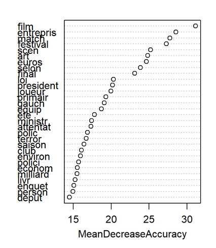
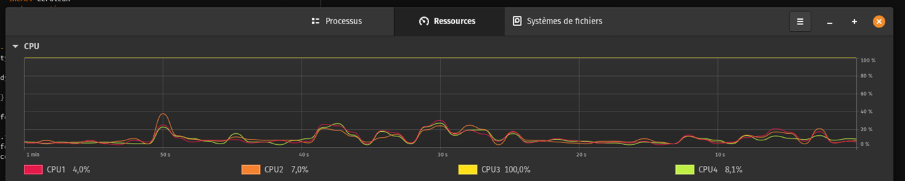
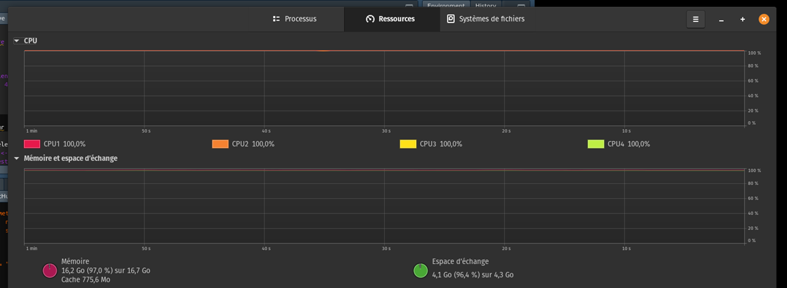

# :page_facing_up: Classification-Article-Le-Monde  :page_with_curl:

## :fast_forward: [Rapport](https://CharlesVitry.github.io/Classification-Article-Le-Monde/) :rewind:
***
## Présentation projet

* **Ensemble variables explicatives Xi** : nbre d’occurences des mots dans l’article.
* **Variable à expliquer** : la catégorie de l’article. (Multi-classes prédiction)
* **Fonction de perte/évaluation** : Matrice de confusion/AUC
* **Modèles** : __CART__(cp), __RandomForest__(mtry), __SVM__(sigma/cost)
* **Méthode pour éviter le sur-apprentissage** : Validation croisée.

***

## Résultat

Nous avons choisis de réaliser d’effectuer des classification multi-classes au lieu d’une classification binaire (Economie ou non Economie).
|Modèle | AUC Training | AUC Testing|
|-------|--------------|------------|
|CART   | 0,86         | 0,90       |
|CART CV|  0,93 | 0,89
|RF      |0,99  |0,91 |
|RF CV |  0,99 | 0,92|
|SVM | 0,96 |0,84 |
|SVM CV | 0,93  |0,87|
|RF w\ 25 var | 0,93 | 0,87|

Après optimisation de chacun de nos modèles par cross-validation & hyperparamètres, la probabilité qu’un article d’une telle catégorie soit classé dans cette catégorie est proche de 90% pour chacun de nos modèles optimisés.

Afin d’améliorer les résultats, nous aurions pu baisser le minfreq afin d’avoir plus de variables explicatives. Cela aurait augmenter les temps de calculs, et particulièrement lors de l’amélioration des modèles.

Le choix de la metric "Accuracy" pour l'optimisation de nos modèles a été arbitraire, après visualisation des matrices de confusion, on remarque que les proportions des catégories ont eu beaucoup d'influence. Ainsi les articles de catégorie "planete" sont très mal prédis. Une metric qui pénalise plus les erreurs sur cette catégorie aurait éviter ce problème.

Nous avons réalisé des modèles “simples” pour tester les modèles, puis des modèles optimisés où nous réalisions une cross-validation et une optimisation des hyperparamètres. Nous pouvons observer une amélioration entre les modèles simples et leurs modèles optimisé.

***

Pour la sélection d'un modèle à 25 variables maximum

```modele_rf$importance[order(modele_rf$importance[,1], decreasing = TRUE)[1:25], ]```



La forte réduction du nombre de variable sur le modèle randomForest a eu un impact mineur sur l’AUC.( à modèle comparable)

## Optimisation de la puissance de calcul

Utilisation de la librairie DoSnow pour utiliser les 8 threads de mon processeur.

*Avant*



*Après*




